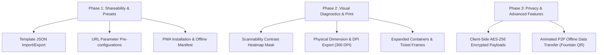

# OpenQR: Competitive Landscape & Differentiation Strategy

## Executive Summary

**OpenQR** is a privacy-first, 100% client-side, open-source QR code generator and design studio. While most online QR tools have shifted to paid subscription models (monetizing high-res exports, custom shapes, dynamic redirects, and brand logos), OpenQR delivers complete customization, instant real-time scan verification, and offline execution without data collection.

This document outlines the current landscape of open-source QR tools and defines a product roadmap of innovative features that will establish **OpenQR** as the premier open-source QR generation studio.

---

## 1. Competitive Landscape

### Existing Open-Source & Popular Tools

| Tool / Project | Type | Key Strengths | Limitations / Gaps |
| :--- | :--- | :--- | :--- |
| **`qr-code-styling`** | JS Library | Highly customizable rendering engine (dot shapes, corner frames, gradients, logos). | Core library for developers; lacks an end-user studio application. |
| **`Dub.co`** | Open-Source Platform | Modern Next.js link management, dynamic redirects, analytics, clean UI. | Focuses on link analytics rather than rich visual design or client-side privacy. |
| **`Nayuki qrcodegen`** | Multi-Language Library | Spec-compliant, lightweight core generator (TypeScript, Rust, Python, C++, Java). | Low-level utility for devs; no styling, UI canvas, or visual editing capabilities. |
| **`QRCoder` (.NET)** | C# Library | Broad payload formatters (Swiss QR Bill, SEPA crypto payments, vCards). | Backend developer library; no interactive web canvas or real-time verification. |
| **`Segno` / `python-qrcode`** | Python CLI / Package | Supports Micro QR codes, multi-frame GIF output, EPS/SVG generation. | CLI/script-driven; no real-time browser design studio. |
| **`QRCode Monkey`** | Proprietary / Freemium | Rich visual styling, preset templates, popular design reference. | Closed-source SaaS; paywalled features, potential user tracking. |

---

## 2. Current OpenQR Strengths

OpenQR already includes key features that distinguish it from standard generators:

- **100% Client-Side Privacy**: Operates strictly within the browser. Zero analytics, zero backend requests, and complete offline capability.
- **Real-Time Verification Engine**: Integrates `jsQR` to continuously test and confirm canvas scannability during customization.
- **Rich Customization Studio**: Supports custom dot modules, corner eyes, linear/radial gradients, transparent backgrounds, and call-to-action frames ("SCAN ME").
- **Multi-Format & Bulk Export**: High-res PNG/WEBP up to 4096px, scalable SVG, vector PDF, and multi-payload CSV bulk ZIP generation.

---

## 3. Strategic Features to Make OpenQR Stand Out

To outperform existing open-source and commercial tools, OpenQR can implement the following groundbreaking features:

### 🎨 Feature 1: Advanced Aesthetic Framing & Creative Containers
- **Non-Square Outer Frames**: Introduce stylized containers (e.g., smartphone mockups, event ticket stubs, rounded badges, coffee cup frames).
- **Expanded Module Patterns**: Add specialized module shapes (e.g., starbursts, diamonds, heart dots, crosshairs).
- **Background Image Blending (Stencil Mode)**: Overlay QR codes onto custom background images/textures with automated contrast thresholding to maintain scannability.

### 🔍 Feature 2: Visual Scannability Diagnostics & Heatmaps
- **Contrast Safety Mask / Heatmap**: Render an interactive warning overlay highlighting low-contrast regions or logo overlaps that impair readability.
- **Real-World Environmental Simulator**: Provide live preview filters simulating low-light conditions, smartphone camera lens blur, distance scanning, and print paper textures.

### 🔐 Feature 3: Privacy & Advanced Offline Utilities
- **Client-Side Encrypted Payloads (AES-256)**: Allow users to password-protect sensitive QR codes (Wi-Fi passwords, private contact cards, encrypted notes). Anyone scanning must enter the passphrase in OpenQR to decrypt the payload.
- **Animated P2P Data Transfer (Fountain QR)**: Enable chunking larger payloads or small files into sequential, animated QR codes scan-readable across offline devices (similar to txqr protocols).

### 🖨️ Feature 4: Professional Print & Graphic Design Workflow
- **Template Preset Import / Export**: Allow designers to export and share custom styling configurations as JSON files.
- **Print Standards Configurator**: Provide explicit DPI targets (300 DPI / 600 DPI) and exact physical dimension inputs (e.g., `50mm x 50mm`) for professional vector printing.
- **Deep Link URL Presets**: Support URL parameters (e.g., `openqr.app/#theme=cyberpunk&payload=...`) for sharing exact QR configurations instantly.

### 📱 Feature 5: Progressive Web App (PWA) & Offline Desktop Install
- **Installable PWA**: Add Web App Manifest and Service Workers to make OpenQR installable on desktop and mobile devices for native offline usage.
- **Web Share Target Integration**: Allow users to share links or text directly into OpenQR from mobile OS context menus to generate QR codes instantly.

---

## 4. Suggested Implementation Roadmap

---

*Document generated for OpenQR architectural planning.*
